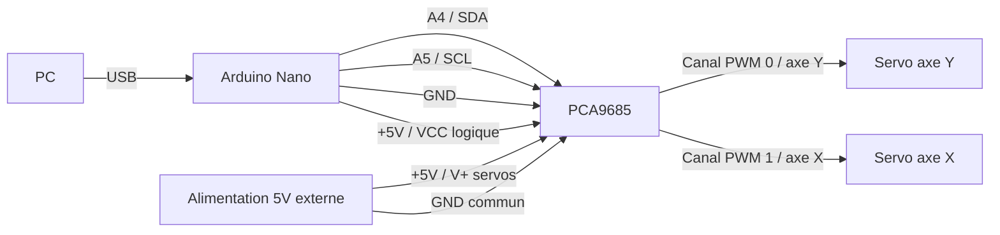

# L.O.C.K.O.N
# Laser Optimized Capture & Kinetic Observation Node

## Objectif

LOCKON est une tourelle motorisee capable de :

- detecter une cible via vision par ordinateur
- suivre automatiquement la cible (tracking)
- orienter une camera sur 2 axes (pan / tilt)
- activer un laser lorsque la cible est verrouillee

---

## Fonctionnement

1. La camera envoie le flux video au PC
2. Le module de vision detecte la cible
3. Le programme calcule la position de la cible
4. Envoi des angles a l'Arduino
5. L'Arduino pilote les servos via le PCA9685
6. Le laser s'allume lorsque la cible est centree

---

## Architecture

## Materiel

### Vision
- Camera USB OV9732 (100 degres, 720p, global shutter)

### Mecanique
- Support pan-tilt aluminium 2 axes
- 2 servos 20 kg

### Electronique
- Arduino Nano (ATmega328)
- Driver PWM PCA9685 (16 canaux)
- Alimentation 5V 5A
- Module laser 5V (650 nm)
- Condensateur 470 uF

### Divers
- Cables Dupont
- Visserie / entretoises

---

### Branchements

Etat actuel : l'Arduino est branche au PC en USB. Le PCA9685 est relie a
l'Arduino pour l'I2C et l'alimentation logique. La carte PCA9685 recoit aussi
une alimentation 5V cote servos.



| Arduino Nano | PCA9685 | Role |
| --- | --- | --- |
| A4 | SDA | Donnees I2C |
| A5 | SCL | Horloge I2C |
| GND | GND | Masse commune |
| +5V | VCC | Alimentation logique du PCA9685 |

| Alimentation externe 5V | PCA9685 | Role |
| --- | --- | --- |
| +5V | V+ | Alimentation des servos |
| GND | GND | Masse commune avec Arduino/PCA |

---

## Test et debug des servos

Le sketch `esp32_prog/esp32_prog.ino` est un sketch de diagnostic pour tester le
PCA9685 et les deux servos.

### Procedure

1. Brancher uniquement Arduino + PCA9685, sans servo.
2. Televerser le sketch Arduino.
3. Ouvrir le moniteur serie en `115200 bauds`.
4. Verifier que le message `PCA9685 detecte a l'adresse 0x40.` apparait.
5. Couper l'alimentation.
6. Brancher un seul servo sur le canal `0`.
7. Remettre l'alimentation 5V externe du PCA9685.
8. Verifier que le servo bouge entre centre, min et max.
9. Couper l'alimentation, puis brancher le deuxieme servo sur le canal `1`.
10. Relancer le test avec les deux servos.

### Points a verifier si rien ne bouge

- Le PCA9685 doit etre detecte sur l'I2C, normalement a l'adresse `0x40`.
- Si le moniteur serie affiche seulement l'en-tete puis plus rien, le programme
  bloque probablement pendant une transaction I2C. Verifier surtout `SDA`,
  `SCL`, `VCC`, `GND`, et retirer temporairement les servos.
- `GND Arduino`, `GND PCA9685` et `GND alimentation servos` doivent etre communs.
- Les servos ne doivent pas etre alimentes par le `5V` de l'Arduino.
- Le bornier `V+` du PCA9685 doit recevoir le `+5V` de l'alimentation externe.
- Le connecteur servo doit etre dans le bon sens : signal PWM, `V+`, `GND`.
- Tester d'abord un seul servo pour eviter une chute de tension.
- Si le servo grogne mais ne tourne pas, verifier l'alimentation 5V et le courant disponible.
- Si le moniteur serie affiche `PCA9685 absent`, verifier `A4/SDA`, `A5/SCL`, `VCC` et `GND`.

### Canaux utilises

| Canal PCA9685 | Role |
| --- | --- |
| 0 | Servo axe Y |
| 1 | Servo axe X |

---

## LOCKON v0.1 - Interface manuelle

Le script `lockon_gui.py` fournit une interface graphique simple pour piloter
les deux servos depuis le PC.

### Lancement

```powershell
python -m pip install -r requirements.txt
python lockon_gui.py
```

### Fonctionnalites

- Connexion au port serie de l'Arduino.
- Affichage de 4 fleches directionnelles.
- Pilotage a la souris via les boutons de l'interface.
- Pilotage au clavier avec les touches flechees.
- Affichage de `Pos X` et `Pos Y`.
- Parametre `Vitesse` saisissable puis applique avec le bouton `Envoyer`.
- Affichage de la vitesse appliquee dans la zone `Etat`.
- Bouton `CENTRE` pour revenir a `X=0`, `Y=0`.

La vitesse GUI accepte une valeur de `1` a `500`. Cette limite vient de la
datasheet du MG996R, qui annonce environ `0.17 s / 60 degres` a `4.8V` et
`0.14 s / 60 degres` a `6V`.

### Protocole serie

Le PC envoie des commandes texte a l'Arduino :

```text
POS x y
```

Exemple :

```text
POS 20 -10
```

Les positions calibrees vont de `-1120` a `1240`. L'Arduino convertit directement
la position en microsecondes autour du centre `1500us` :

```text
pulse servo = 1500us + position
```

Les valeurs actuelles correspondent aux limites observees sur la tourelle.

### Canaux v0.1

| Canal PCA9685 | Axe logiciel |
| --- | --- |
| 0 | Y |
| 1 | X |

### Controles v0.1

| Controle | Axe commande |
| --- | --- |
| Fleche haut | X + |
| Fleche bas | X - |
| Fleche gauche | Y - |
| Fleche droite | Y + |
